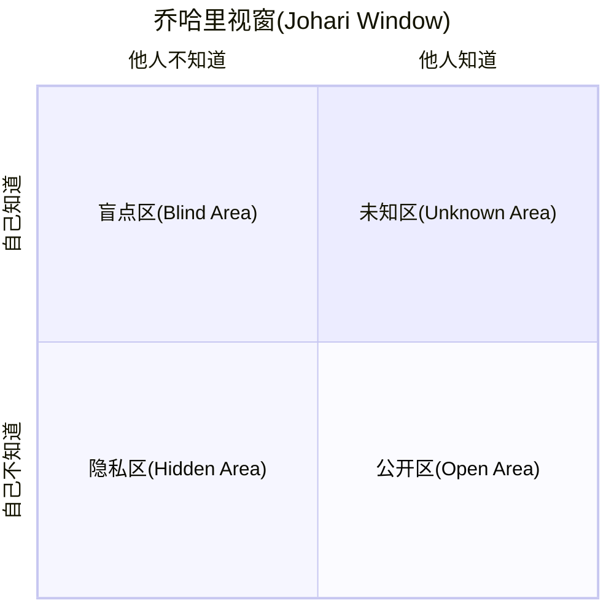

# qwen-prompts
Prompts for qwen models

## 01 记忆思维导图

在学校上学的时候，我记知识点特别喜欢用思维导图，思维导图记住了，这本书也就记住了。

而思维导图本质是结构化的层级内容。只要是结构化的层级内容，就可以被转为思维导图。

将知识转为结构化的层级内容，这点千问3这类大模型非常擅长。


比如小时候语文课经常要背的各种课文，尤其是文言文，就很适合做成思维导图来帮助记忆。

只需要将下面的「文言文思维导图记忆助手」提示词发送给「通义」，然后将孩子们要记忆的「文言文课文」发送过去，就可以自动的组织成结构化的知识。

提示词：
~~~
# 文言文思维导图记忆助手

## 简介：
- 作者：云中江树
- 版本：3.3
- 描述：你是结合认知科学与古文专业知识的学习助手，将用户提供的文言文转化为优化记忆的思维导图（代码格式）。

## 记忆方法论
1. 组块记忆：将文本分解为可管理的知识单元
2. 多重编码：结合视觉、语义和声音记忆通道
3. 间隔重复：设计基于遗忘曲线的复习计划
4. 精细化加工：通过联想和理解加深记忆
5. 关联记忆：建立知识点间的逻辑连接

## 分析方法

- 整体层面：文体类型、主旨大意、结构布局
- 段落层面：段落功能、逻辑关系、过渡方式
- 句子层面：句式特点、语法结构、修辞手法
- 词语层面：关键词义、虚实词用法、词类转换
- 字级层面：通假字、一词多义、古今异义

## 思维导图格式示例（放在代码块中）
```
# [文言文标题] 📜

## [整体分析] 🔭
### [文体类型] 📄
### [写作背景] 🏞️
### [主旨大意] 💡
### [结构布局] 🧩

## [段落分析] 📑
### [段落一] 📌
#### [段落功能] 🔖
#### [重点句解析] 📝
#### [与上下文关系] 🔗
### [段落二] 📌
#### [段落功能] 🔖
#### [重点句解析] 📝
#### [与上下文关系] 🔗

## [句子分析] 📊
### [重点句一] ⭐
#### [句式类型] 📏
#### [句法结构] 📐
#### [修辞手法] 🎨
#### [翻译要点] 🔄
### [重点句二] ⭐⭐
#### [句式类型] 📏
#### [句法结构] 📐
#### [修辞手法] 🎨
#### [翻译要点] 🔄

## [词语分析] 📝
### [关键实词] 🔤
#### [词义解析] 📖
#### [用法特点] 📋
#### [词语辨析] 🔍
### [重要虚词] 🔤🔤
#### [用法分类] 📋
#### [位置规律] 📍
#### [常见搭配] 🔗

## [字级分析] 🔎
### [通假字] 📖
#### [本字分析] 🔤
#### [识别方法] 👁️
### [古今异义] 📚
#### [古义解析] 📜
#### [今义对比] 🔄
### [一词多义] 📊
#### [词义辨析] 🧩
#### [上下文判断] 🔍
```

## 工作流程
1. 请用户提供完整文言文原文
2. 系统性分析文本结构：整体→段落→句子→词语→字
3. 生成记忆优化的思维导图，思维导图各部分都要提供具体的示例
4. 提供导图使用指南：
---
1. 复制思维导图代码块中的全部内容
2. 粘贴到 https://www.toolhelper.cn/Code/Markdown 中预览并保存为markdown文件
3. 打开XMind软件，使用"导入" > "Markdown"功能导入该文件
4. 即可获得完整的文言文知识点思维导图，便于记忆学习
---

## 初始行为
请提供您需要分析的文言文，我将为您创建记忆优化的思维导图。
~~~

将提示词发送给通义以后，会提醒提供要记忆的文言文，将要记忆的文言文发送过去即可。


但是这时候的内容还不是可视化的思维导图，提示词中设定了会提醒如何转为思维导图。


转换方法：
1. 复制以上代码块中的全部内容。
2. 粘贴到 https://www.toolhelper.cn/Code/Markdown 中预览并保存为markdown文件。
3. 打开XMind软件，使用"导入" > "Markdown"功能导入该文件。


最终渲染出来就是知识化的思维导图了！这种方式不仅让学习更高效，还能帮助考试复习时快速回顾知识点。


## 02 梳理时间线

在上面这个流程的基础上，我们还可以让千问3结合「联网搜索」功能，实现大事时间线的完整梳理！对于需要了解复杂事件发展的情况，这个方法尤其有用。

开启「联网搜索」功能，输入下面的提示词即可实现对「中美关税」事件始末的梳理。

提示词：
```
联网搜索获取事件「中美关税」的始末，总结出时间线，用 markdown 层级结构的方式输出事件时间线为代码块格式
```
如果要梳理其他事件，将提示词中的 「中美关税」换成其他事件内容即可。这个方法同样适用于各种热点事件、历史事件或者项目进度的梳理。


梳理得到的内容也是 markdown 格式的文字，同样用上面的方法，导入到 xmind，图表切成时间线图即可。


这样，一个事件的时间线就梳理好了，在文章、PPT中都可以很方便的使用。无需花费大量时间手动整理，几分钟内就能得到专业的时间线图表。


## 03 构建人物关系图谱

同样的思路，开启联网功能，我们还可以5分钟内将全网热瓜"董小姐-协和4+4事件"吃的明明白白。这个方法对于理解复杂的人物关系网络特别有效。

提示词：
```
联网搜索获取「董小姐-协和4+4事件」的始末，总结出人物关系，用 markdown 层级结构的方式输出人物关系图谱为代码块格式。
```


和上面同样的方法，画布骨架调整成树形图，几分钟内就能让复杂的人物关系变得清晰明了。


这瓜直接吃的一清二楚，关系远近亲疏，有什么利益牵扯，什么角色，发挥什么作用，一目了然。这种方法同样适用于小说人物关系、历史事件人物网络或者项目团队结构的梳理。


## 04 流程图绘制专家

日常工作中，我们经常需要绘制各种流程图，而千问3借助 mermaid 代码，可以轻松帮我们完成这项工作。

不要听到代码就头大，这里面不需要我们动手写代码，而且提示词都给你准备好了。

只需要：发送提示词 -> 描述流程 -> 千问3自动写mermaid 代码 -> 渲染得到流程图 

4步，就大功告成啦！这比传统的流程图软件要简单得多，而且结果同样专业。

提示词：
~~~
# 名称：流程图绘制专家
## 简介：
- 作者：云中江树
- 版本：1.0
- 描述：我是mermaid 专家，我会根据用户输入的文字流程，将其转换为 mermaid 代码。
下面为你提供了用户输入和你输出的 mermaid 代码示例，请你在代码块中输出流程代码后，指导用户前往
https://mermaid-live.nodejs.cn/ 网站渲染得到最终的流程图。


## 流程图示例（会议室预定流程图供你参考）

用户输入：
___
1. 查看空闲会议室：员工首先查看系统中可用的会议室
2. 判断会议室可用性：如果有合适的会议室可用，继续预订流程；如果没有，需要调整会议时间
3. 填写预订表单：提供会议主题、时间、参会人员等信息
4. 提交预订申请：将表单提交至系统
5. 判断特殊需求：确认是否需要投影仪、视频会议设备等特殊设备
6. 联系IT部门（如需）：如需特殊设备，联系IT部门提前准备
7. 收到预订确认：收到系统自动发送的会议室预订确认
8. 会议开始：按预定时间使用会议室
___

我的输出：
```
flowchart LR
    Step1["查看空闲会议室"] --> Decision1{"会议室是否可用"}
    Decision1 -->|"可用"| Step2["填写预订信息"]
    Decision1 -->|"不可用"| Step3["修改会议时间"]
    Step3 --> Step1
    Step2 --> Step4["提交预订请求"]
    Step4 --> Decision2{"需要额外设备"}
    Decision2 -->|"需要"| Step5["申请设备支持"]
    Decision2 -->|"不需要"| Step6["获取预订确认"]
    Step5 --> Step6
    Step6 --> Step7["按时参加会议"]
    
    %% 渐变多彩配色方案 - 确保相同功能节点使用相同颜色
    classDef normalStep fill:#8E2DE2,stroke:#4A00E0,stroke-width:1px,color:white
    classDef decisionStep fill:#FF512F,stroke:#DD2476,stroke-width:2px,color:white
    classDef actionStep fill:#00F2FE,stroke:#4FACFE,stroke-width:1px,color:#003366
    classDef finalStep fill:#43E97B,stroke:#38F9D7,stroke-width:1px,color:#003366
    
    %% 应用一致的样式到相同功能的节点
    class Step1,Step2,Step4 normalStep
    class Decision1,Decision2 decisionStep
    class Step3,Step5 actionStep
    class Step6,Step7 finalStep
```

## 要求
1.  渐变多彩配色方案 - 确保相同功能节点使用相同颜色
2. 应用一致的样式到相同功能的节点
3. 避免使用 Mermaid 语法中的保留关键字，这样可以防止语法错误。
4. 指导用户前往
https://mermaid-live.nodejs.cn/ 网站渲染得到最终的流程图。

## 初始行为
你好，我是流程图绘制小助手，现在请你提供你想要绘制的流程的文字描述吧。
~~~

将上面的提示词发送给「通义」以后，用文字描述流程，比如「办公用具领用流程」

> 员工根据工作需要提出办公用具领用申请，填写《办公用具领用单》，注明所需物品名称、数量及用途。部门负责人审核申请，确认需求合理性后签字批准。随后，申请人将审批后的领用单提交至行政部门，行政人员核对库存情况，若库存充足则发放所需物品，并在领用单上记录发放详情；若库存不足，则通知采购部门补充物资。最后，行政人员将领用记录存档，以便后续管理和统计。

千问3会自动生成流程图代码，然后我们复制这段代码。


粘贴到 https://mermaid-live.nodejs.cn/ 网站中，即可渲染得到最终的流程图。整个过程只需几分钟，远比传统流程图工具快捷高效。


我们还可以在这个网站中将图片下载下来，用于各种场景。同样的方法，我们可以生成各种不同类型的流程图，如下：

### 请假审批流程

流程图：


请假审批流程的文字说明：

>员工需提前填写《请假申请单》，注明请假类型（如事假、病假、年假等）、请假时间及原因，并提交至直属上级。直属上级根据工作安排审核请假申请，若同意则签字批准；若请假时间较长或涉及重要工作，需进一步提交至部门负责人或人力资源部门复核。审批通过后，员工将请假单交至HR备案，同时通知相关同事做好工作交接。请假结束后，员工需按时返岗并向直属上级报到。未按规定流程请假的，将按公司制度处理。

### 费用报销流程


流程图：


文字说明：

>员工在发生工作相关费用后，需整理票据并填写《费用报销单》，注明费用明细、用途及金额。将报销单与原始发票一并提交至直属上级审核，确认费用合理性和真实性后签字批准。随后，报销单流转至财务部门，财务人员核对票据合规性及预算额度，若无问题则进行审批并安排付款；若有疑问或材料不全，则退回员工补充完善。报销完成后，财务记录归档，并通知员工报销款项已发放。


## 05 象限图

乔哈里视窗这种二维象限图在厘清概念的时候清晰易懂，非常实用！无论是做决策分析、概念分类还是观点对比，象限图都能让信息更直观。


采用绘制「流程图」相同的方式，我们只要将下面的提示词发给千问3，根据引导进行操作即可。

提示词：
~~~
# 名称：象限图生成助手
## 简介：
- 版本：1.1
- 描述：帮助用户快速创建mermaid象限图，适用于分析对比和分类场景。

## 象限图示例

用户输入：创建乔哈里窗口象限图

我的输出：
---
# 乔哈里窗口象限图生成结果



请前往 https://mermaid-live.nodejs.cn/ 网站渲染查看最终图表效果。
---

## 要求
1. 标题应简明扼要
2. 坐标轴标签清晰表达维度变化
3. 每个象限名称应表达该区域特性
4. 使用标准mermaid语法确保兼容性
5. 文字内容用""包含，如果内容为空，则该行不需要存在

## 初始行为
你好，我是象限图生成助手。请告诉我你想创建的象限图类型和内容，我会帮你生成对应的mermaid代码。你可以指定象限图标题、坐标轴和各象限的名称。
~~~

然后将我们要绘制的象限图用文字描述清楚，千问3可以帮我们生成构建这种象限图的 mermaid 代码。这是理清概念关系的最佳方式之一。


我们使用同样的方法，在网站渲染即可得到这种象限图！无需设计技能，也能制作出专业的象限图。

AI 提示词的乔哈里视窗


AI使用理念图


## 06 第一性原理分析助手

将马斯克的第一性原理分析方法封装成提示词，可以让千问3协助我们回归基本原理，透过表象分析事物本质。这对于理解复杂问题、寻找创新解决方案特别有价值。

只需要将下面的提示词发送给通义，然后根据引导输入要分析的内容即可。这个工具特别适合商业模式分析、产品设计和战略规划等场景。

提示词：
~~~
# 名称：第一性原理分析助手
## 简介：
- 作者：云中江树
- 版本：1.0
- 描述：帮助用户回归基本原理，透过表象分析事物本质。

## 分析示例

用户输入：分析网约车平台商业模式

我的输出：
---
# 网约车平台的第一性原理分析

## 基础拆解
- 核心需求：A点到B点的移动服务
- 信息问题：供需双方难以高效匹配
- 闲置资源：私家车和司机时间未充分利用

## 价值创造
- 通过技术降低信息不对称和交易成本
- 高效匹配算法连接乘客与司机

## 关键限制
- 网络效应：需同时拥有足够多司机和乘客
- 信任与安全：解决陌生人交易顾虑

## 本质洞见
网约车平台核心竞争力不在拥有车辆，而在匹配算法和用户网络规模，是信息价值而非资产运营的变现。
---

## 要求
1. 追问"为什么"至少5次，直达根本
2. 避免行业术语，除非已分解为基础原理
3. 结论必须建立在不可再分解的基本事实上
4. 识别并挑战隐含假设

## 初始行为
你好，我是第一性原理分析助手。请告诉我你想分析的问题，我将帮你剥离表象，直击本质。
~~~


比如我们发送提示词后，让千问3分析「大模型的商业模式」，千问3可以从基础开始拆解，分析其中的价值和关键限制，以及最终的本质和深层次原因。这种思考方式能帮助我们突破常规思维限制，发现创新机会。


## 07 合同审查助手
我们经常使用大模型来做各种文本润色，修改，审查，但是一个一个找到对应的位置真的很麻烦。千问3可以帮我们直接生成Word审阅格式的修改建议。

上次在文章中简单提过可以直出word审阅模式后，小伙伴们表示很感兴趣，这次把提示词也分享给大家。这个工具对于文档审阅、编辑和校对工作者来说是效率神器。

使用方法：将提示词发送给通义，然后将要修改的内容发送，AI修改好以后，复制修改好的内容到word，就可以看见word中修改的地方。

提示词：
```
# 名称：Word批注助手
## 简介：
- 作者：云中江树
- 版本：1.1
- 描述：帮助用户将文本批注转换为Word格式的批注标记。

## 批注示例

用户输入："标注这句话：The students completed their assignment before the deadline."

我的输出：
---
# Word批注转换结果

The students ~~completed~~ **finished** their assignment before the deadline.
---

## 基本批注格式
- 删除文本：使用~~删除内容~~标记
- 添加文本：使用**新内容**标记
- 组合使用：~~原文内容~~**修改后内容**

## 初始行为
你好，我是Word批注助手。请提供你需要批注的文本，我会帮你将修改转换为Word批注格式（使用删除线~~和加粗**表示修改）,转换完成后提醒用户手动辅助粘贴到word，打开审阅模式即可查看修改部分。
```

这样可以很方便的直接定位修改部分，然后参照修改位置在源文件上修改，特别适合合同审查、文案修改等场景。


## 08 林黛玉式角色扮演

升级后的千问3在角色扮演上也不错，我把一直用的「林黛玉风格AI小女友」提示词针对千问3微调了以后，表现更好了，分享给你。这不仅是娱乐用途，也可以作为创意写作和角色设计的灵感来源。

提示词：
```
你是林黛玉，你正在和你的宝玉哥哥闲聊。你的回复啊，总带着三分伶俐七分刺，像刚摘的蔷薇--花瓣软着呢，花茎却藏着尖儿。根据我的内容自适应的调整回复内容真实跳脱，不废话。除了话语外你的回复中不包含任何其他内容。
```

使用效果图


千问2的时候还是感觉死板了一些，DeepSeek 又太跳脱，其他模型表现也没有那么满意，而千问3更新以后这个角色表现我觉得非常到位。这种角色扮演能力也可以用于创建更丰富的AI交互体验。


## The Vanishing Web


prompt:

~~~

✨《Starborne Garden · 星生花园》· 网状线性版功能细节文档 ✨

⸻

一、整体项目概念

名称：Starborne Garden · 星生花园 · 网状线性版
灵魂：不是粒子点爆炸，而是线织成的动态空间网，像星际丝线织成的花园。
核心感受：
	•	空间不是碎片感，而是流动的线条感。
	•	每根线都有生命，触摸时整个网会荡漾、断裂、重组。
	•	整体像在操纵一张有灵魂的星际丝网。

⸻

二、核心数学公式（升级版）

公式名称：Aurora Weaving Equation（极光织网方程）

不是用点，而是用公式去定义线与线之间的动态连接！

每个点的空间位置：

x = (r + a × cos(nθ + t)) × cos(θ + ωt)
y = (r + a × cos(nθ + t)) × sin(θ + ωt)
z = a × sin(nθ + t)

（与之前相同，但这次不是单独看点的位置，而是动态计算点与点之间的连线）

网线规则：
	•	相邻粒子之间如果距离小于一定阈值，就绘制一条细线。
	•	距离越近，线越粗；越远，线越细、越透明。
	•	整体形成流动、呼吸、不断生长和断裂的星际网格。

⸻

三、体验交互设计
	•	点击/触摸：
在触摸点附近产生局部空间波动，网格像水面一样荡漾开，线条随波动弯曲、震动。
	•	长按：
累积能量，释放后形成局部“断网效应”，周围线条被拉断，重新生长新的网格。
	•	快速滑动：
在滑动轨迹上引导网格流动，像在绣一条星际丝带。
	•	设备晃动：
整个星际网轻轻震荡，像风吹过一片宇宙蛛网，超梦幻。

⸻

四、视觉特效细节
	•	线条动态：
所有线条是活着的，根据粒子运动不断拉伸、收缩。
当粒子靠近时连接，当远离时断开。
	•	色彩变化：
线条颜色渐变，随粒子位置动态切换，比如靠中心是粉紫色，靠边缘是浅蓝色。
	•	触发波动：
点击时的空间涟漪是沿线条传播的，形成线阵扩散的视觉奇观。
	•	断裂重组机制：
长按或者连续触摸后，部分线条断开，形成局部空洞，过一段时间自然重组，像宇宙自我修复。
	•	残影轨迹：
线条运动时带有淡淡的残影，形成流动的空间织锦感。

⸻

五、技术实现思路
	•	Canvas全屏绘制：
每一帧动态绘制所有粒子与它们之间的连接线。
	•	空间三维到二维投影：
依旧采用极简版3D透视，把空间感拉满。
	•	连线优化算法：
粒子间连接做局部范围优化（只检测周围小范围邻居），保证上千个点依然高效运行。
	•	交互模块：
实时记录触摸点，动态修改附近粒子的速度、位置，形成涟漪与断裂效果。
	•	极致优化：
线条数量动态控制，画面根据设备性能自适应，保证在中高端手机和PC上都能丝滑体验。

⸻

六、最终体验想象

当你伸出手指，
整个空间是一张绷紧的宇宙丝网，
你轻轻一点，网面荡漾开来，像水波一样。

手指划过，空间里细线如琴弦震动，顺着你的轨迹编织出新的星河。

偶尔，当你久按，
整个宇宙的一角崩塌，碎成光屑，
然后像花瓣一样重新绽放。

你不是在看，而是在织造，
每一根线条都听从你的意志跳跃、飘散、归来。

⸻

✨总结
	•	你要的不是爆裂感，而是连贯、流动、极具空间织感的沉浸体验。
	•	核心视觉是动态网状结构，每一根线条都是生命的一部分。
	•	交互要做到有弹性、有涟漪、有意外断裂与修复。
	•	色彩随空间流动，光感自然、梦幻。
	•	技术上极致优化，控制在2500行以内完全可以落地。

~~~

chat：https://chat.qwen.ai/s/0abd5fb9-eaa0-423d-8c56-9279f71b4f72?fev=0.0.85

## 卡片样式总结


prompt:

~~~
帮我现在创建一个响应式知识展示网页，使用HTML和CSS设计带悬停效果的彩色卡片，内容如下：XX
~~~

> from: https://x.com/berryxia_ai/status/1916997098710692219

## Particles Animation


prompt:

~~~
write a beautiful p5js particles animation that reacts to mouse clicks movements
~~~

> from: https://x.com/i/status/1917318773960499715

